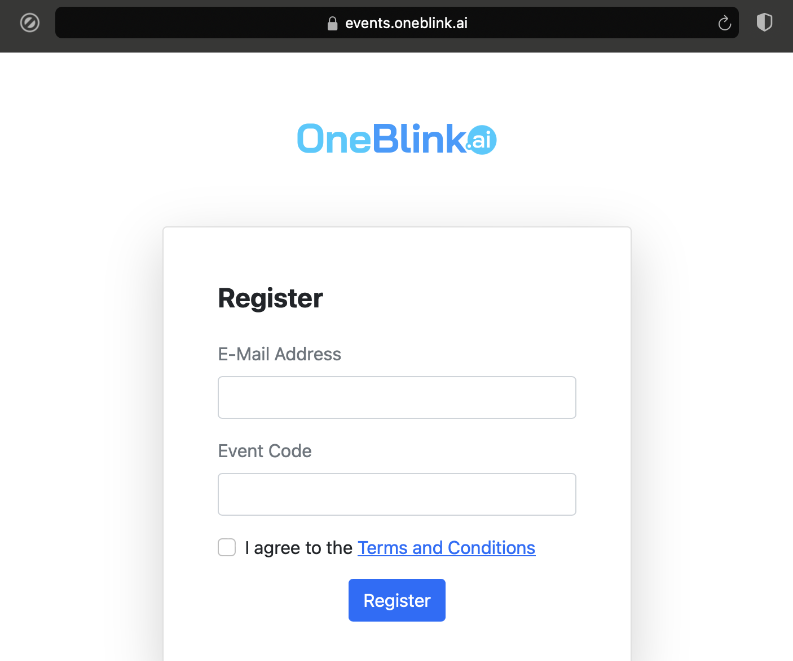
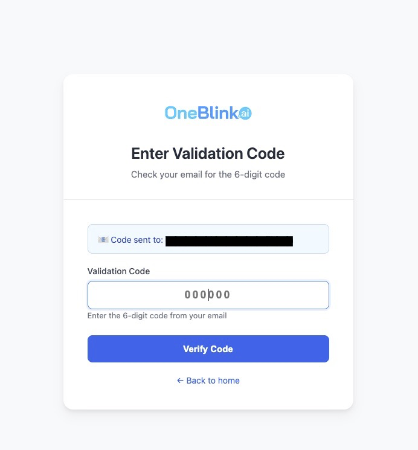
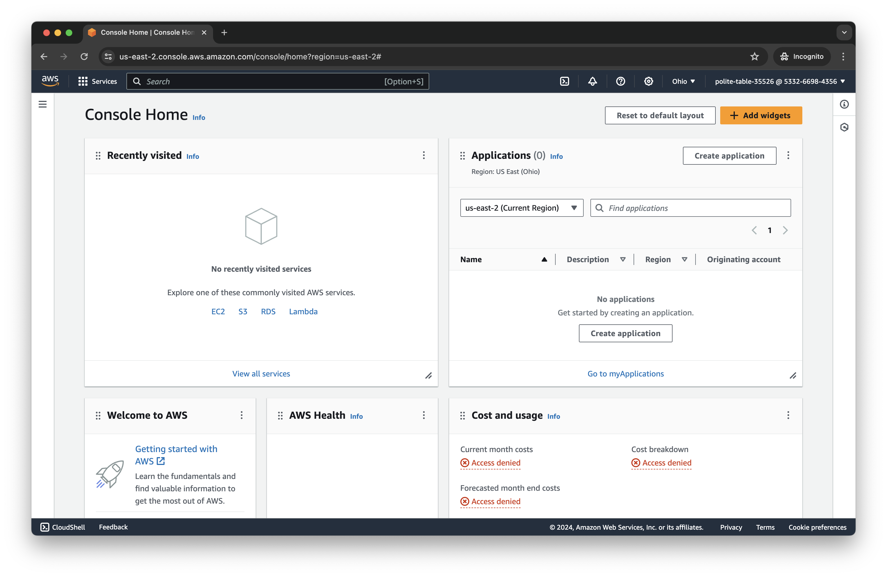

# Lab 0 - Sign In to AWS

In this lab, you will sign in to your AWS account and verify access to Amazon Bedrock services.

**Important:** During the sign-up process, be sure to note your AWS Account ID and Region as they will be needed throughout the labs.

## Option A: Workshop Event (OneBlink)

If you are attending an instructor-led workshop, you will receive credentials through OneBlink:

1. At the end of the first presentation, you will receive an event code
2. Visit [https://events.oneblink.ai](https://events.oneblink.ai)
3. Enter the email you used to register along with the 7-digit event code
4. Check the box to agree to the Terms and Conditions, then click **Register**

Check your mailbox to get the OneBlink validation code, then copy the code.

Enter your email, the event code from the information sheet, and the validation code from your email, then click **Access Sandbox**.

Once validated, you will receive your AWS credentials. **Save this information** - you will need it for all subsequent labs. These accounts will be terminated at the end of the workshop.

## Option B: Using Your Own AWS Account

If you are using your own AWS account:

1. Ensure you have an IAM user with appropriate permissions for:
   - Amazon Bedrock (model access and agent creation)
   - CloudFormation (for CDK deployment)
   - CloudWatch Logs (for monitoring)
2. Create access keys for programmatic access if needed for Labs 4-8

## Sign into AWS Console

1. Open the AWS Console at [https://console.aws.amazon.com/](https://console.aws.amazon.com/)

2. Enter your Account ID (or account alias) and click **Next**

3. Enter your IAM username and password, then click **Sign in**

4. You are now signed in to the AWS Console

## Select the Correct Region

Amazon Bedrock is available in select regions. For this workshop, we recommend **US East (N. Virginia) - us-east-1** for the widest model availability.

1. Look at the region selector in the top-right corner of the console
2. Click on it and select **US East (N. Virginia)**

## Verify Bedrock Access

1. In the AWS Console search bar, type **Bedrock** and select **Amazon Bedrock**

2. You should see the Amazon Bedrock welcome page

3. In the left sidebar, click **Model access** to verify which models are available

**Note:** If this is your first time using Bedrock, you may need to request access to specific models:
- Click **Manage model access**
- Enable **Amazon Titan Text Embeddings V2** (usually approved instantly)
- Enable **Anthropic Claude 3.5 Sonnet** (may take a few minutes)
- Click **Save changes**

## Troubleshooting

### "Access Denied" when accessing Bedrock
- Verify your IAM user has the `AmazonBedrockFullAccess` policy attached
- Check you are in a supported region (us-east-1 recommended)

### Model access shows "Not available"
- Some models require explicit access requests
- Click **Manage model access** and request the needed models
- Titan models are usually instant; Claude may take a few minutes

### Cannot find Bedrock in services
- Ensure you are in a region that supports Bedrock
- Try switching to us-east-1 (N. Virginia)

## Improving the Labs

As you work through these labs, we'd appreciate your feedback. Help us improve by opening an issue at [GitHub Issues](https://github.com/your-org/lab-neo4j-aws/issues). Bug reports, usability suggestions, and general comments are all welcome. Pull requests are great too!

## Next Steps

After completing this lab, continue to [Lab 1 - Neo4j Aura Setup](../Lab_1_Aura_Setup) to set up your Neo4j database through the AWS Marketplace.
