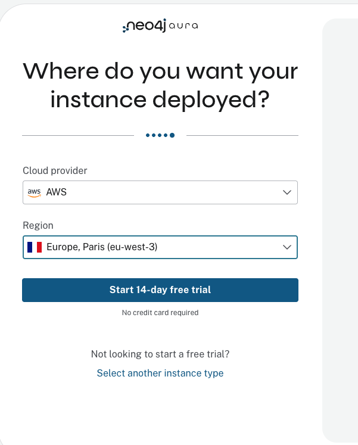
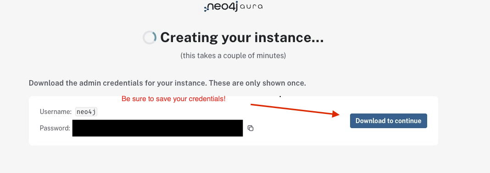

# Neo4j Aura Free Signup

Follow these steps to create a free Neo4j Aura account and database instance:

1. Navigate to [https://console-preview.neo4j.io/](https://console-preview.neo4j.io/)

2. Click on **"Don't have an account? Sign up"** below the login form.

3. Follow the sign-up process to create your Neo4j Aura account. You will need to provide your email address, create a password, and agree to the terms of service.

4. When prompted to create your instance, select the **AuraDB Free** tier. This is a permanent free instance with no expiry.

   

5. Your free Aura instance will be created automatically. **Save your credentials immediately** - click **Download to continue** to save the credentials file. The password is only shown once.

   

6. Once your instance is running, you will see it in the Instances list with a "RUNNING" status.

   

---

**Next:** Return to the [Lab 1 README](README.md#part-2-load-the-knowledge-graph) to continue with loading the knowledge graph. Since your instance was already created during signup, you can skip directly to Part 2.
