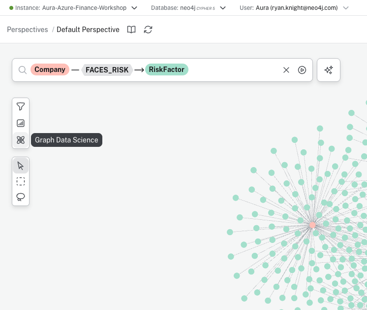
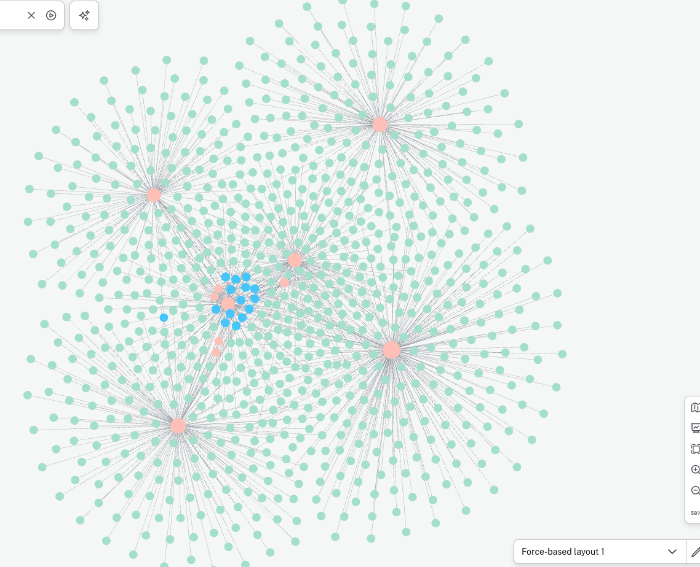

# Exploring the Knowledge Graph

In this section, you will use Neo4j Explore to visually navigate and analyze your knowledge graph. You'll learn how to search for patterns, visualize relationships, and apply graph algorithms to gain insights from your data.

## Step 1: Access the Aura Console

Go to the Neo4j Aura console at [console.neo4j.io](https://console.neo4j.io).

## Step 2: Open Explore

In the left sidebar, click on **Explore** under the Tools section. This opens Neo4j's visual graph exploration tool.


Click **Connect to instance** and select your database instance to connect.


## Step 3: Search for Asset Manager Relationships

In the search bar, build a pattern to explore the relationships between asset managers, companies, and risk factors:

1. Type `AssetManager`
2. Select the **OWNS** relationship
3. Select **Company**
4. Select the **FACES_RISK** relationship
5. Select **RiskFactor**

This creates the pattern: `AssetManager — OWNS → Company — FACES_RISK → RiskFactor`


## Step 4: Visualize the Knowledge Graph

After executing the search, you'll see a visual representation of the knowledge graph showing:
- **AssetManager nodes** (orange/salmon) - Institutional investors like BlackRock, Vanguard
- **Company nodes** (pink) - Tech companies with SEC filings
- **RiskFactor nodes** (yellow) - Risk categories extracted from filings

The visualization reveals how different asset managers are exposed to various risk factors through the companies they own.


### Navigation Tips

**Zoom and Pan:**
- **Zoom**: Scroll wheel or pinch gesture
- **Pan**: Click and drag the canvas
- **Center**: Double-click on empty space

**Inspect Nodes and Relationships:**
- Click on a node to see its properties
- Click on a relationship to see its type and properties
- Double-click a node to expand and see more connections

## Step 5: Access Graph Data Science

To analyze the graph structure, click on the **Graph Data Science** button in the left toolbar. This opens the data science panel where you can apply graph algorithms.



## Step 6: Apply Degree Centrality Algorithm

1. Click **Add algorithm**
2. Select **Degree Centrality** from the dropdown

This algorithm measures the number of incoming and outgoing relationships for each node, helping identify the most connected nodes in your graph.

3. Click **Apply algorithm** to run the analysis


## Step 7: Size Nodes Based on Scores

After the algorithm completes, you'll see a notification showing how many scores were added.

Click **Size nodes based on scores** to visually represent the centrality - nodes with more connections will appear larger.


## Step 8: Analyze the Results

The graph now displays nodes sized according to their degree centrality scores:
- **Larger nodes** = More connections (higher centrality)
- Asset managers owning more companies appear larger
- Companies with more risk factors appear larger

This makes it easy to visually identify:
- The most significant institutional investors
- Companies with diverse risk profiles
- Common risk factors across multiple companies



## Additional Exploration Ideas

Try these patterns to explore more of the knowledge graph:

### Explore Company Products
```
Company — OFFERS → Product
```
Reveals products and services mentioned in filings.

### Explore Competitive Landscape
```
Company — COMPETES_WITH → Company
Company — PARTNERS_WITH → Company
```
Shows competitive and partnership relationships between companies.

### Compare Risk Factors
Click on a specific RiskFactor node and expand to see which companies share that risk.

## Next Steps

Return to the [main lab instructions](README.md) to proceed to Lab 2, where you'll build an AI agent using this knowledge graph.
