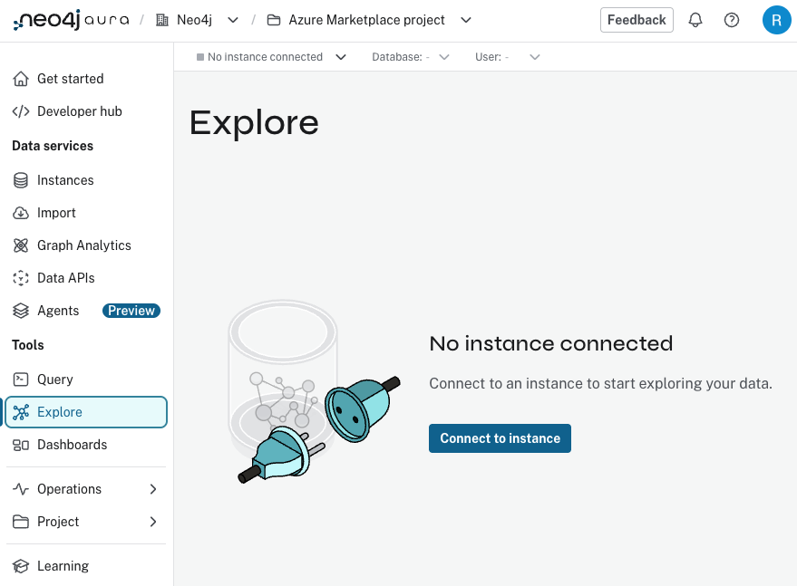
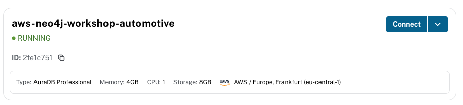
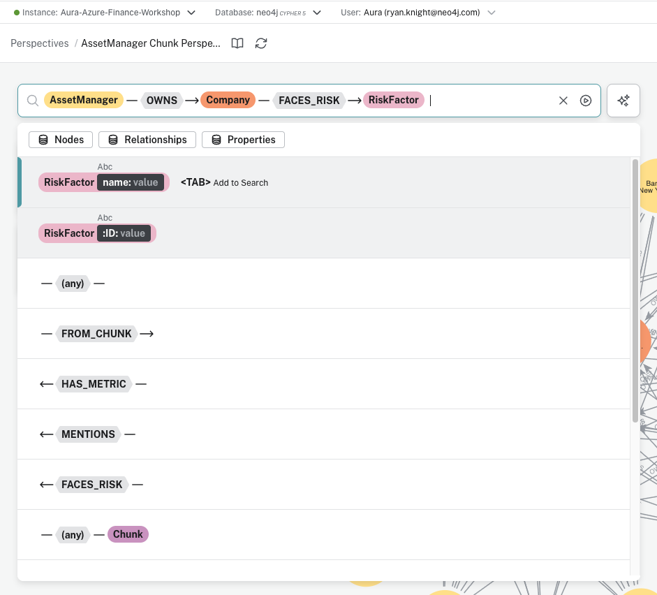
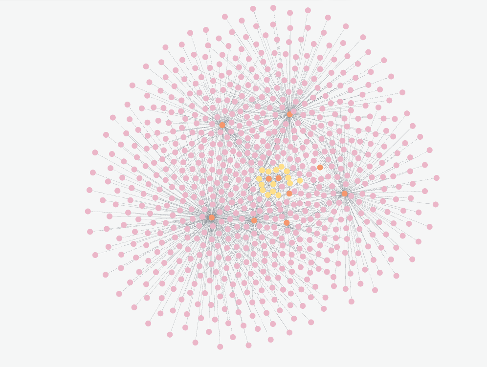
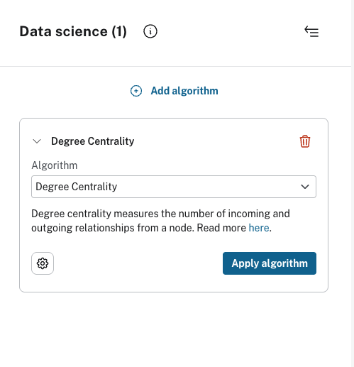
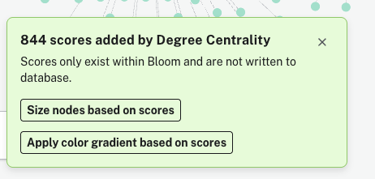
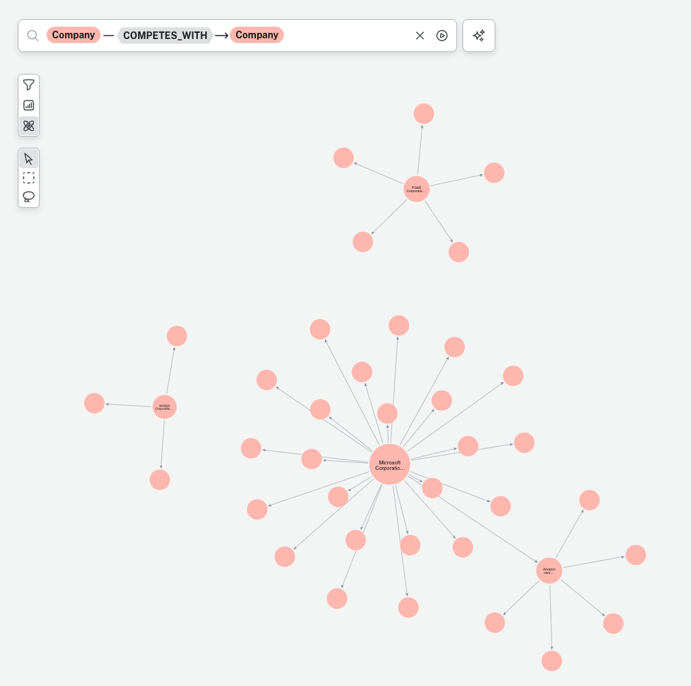

# Exploring the Knowledge Graph

In this section, you will use Neo4j Explore to visually navigate and analyze your knowledge graph. You'll learn how to search for patterns, visualize relationships, and apply graph algorithms to gain insights from your data.

## Step 1: Access the Aura Console

Go to the Neo4j Aura console at [console.neo4j.io](https://console.neo4j.io).

## Step 2: Open Explore

In the left sidebar, click on **Explore** under the Tools section. This opens Neo4j's visual graph exploration tool.



Click **Connect to instance** and select your database instance to connect.



## Step 3: Search for Asset Manager Relationships

In the search bar, build a pattern to explore the relationships between asset managers, companies, and risk factors:

1. Type `AssetManager`
2. Select the **OWNS** relationship
3. Select **Company**
4. Select the **FACES_RISK** relationship
5. Select **RiskFactor**

This creates the pattern: `AssetManager — OWNS → Company — FACES_RISK → RiskFactor`



## Step 4: Visualize the Knowledge Graph

After executing the search, you'll see a visual representation of the knowledge graph showing:
- **AssetManager nodes** (orange/salmon) - Institutional investors like BlackRock, Vanguard
- **Company nodes** (pink) - Tech companies with SEC filings
- **RiskFactor nodes** (yellow) - Risk categories extracted from filings

The visualization reveals how different asset managers are exposed to various risk factors through the companies they own.



### Navigation Tips

**Zoom and Pan:**
- **Zoom**: Scroll wheel or pinch gesture
- **Pan**: Click and drag the canvas
- **Center**: Double-click on empty space

**Inspect Nodes and Relationships:**
- Click on a node to see its properties
- Click on a relationship to see its type and properties
- Double-click a node to expand and see more connections

## Step 5: Explore the Competitive Landscape

Clear the current search and build a new pattern:

1. Type `Company`
2. Select the **COMPETES_WITH** relationship
3. Select **Company**

This creates the pattern: `Company — COMPETES_WITH → Company`

The visualization shows which filing companies compete with which other companies. You'll see Microsoft with the most competitor edges, followed by NVIDIA and Apple. The outer ring of smaller nodes are mentioned companies (Alphabet, Oracle, Samsung, etc.) that appear in filings but aren't filing companies themselves.


## Step 6: Apply Degree Centrality

> **Note:** This requires Graph Analytics to be enabled on your Aura instance. In the Aura Console, go to your instance settings and under **Graph Analytics**, select **Plugin**. If it's not enabled, you'll see a 403 error when applying an algorithm.

With the competitive landscape still on the canvas, open the **Graph Data Science** panel by clicking the connected-nodes icon on the left toolbar.


1. Click **+ Add**
2. Select **Degree Centrality** from the Algorithm dropdown
3. Click **Apply algorithm**



Degree Centrality counts the number of relationships each node has. In this competitive graph, it answers: **which company has the most competitive connections?**

## Step 7: Size Nodes Based on Scores

After the algorithm completes, click **Size nodes based on scores** to visually represent the centrality — nodes with more competitive connections appear larger.



Microsoft will dominate the visualization (32 competitor edges), making it immediately obvious which filing company operates in the most competitive markets. Mentioned companies like Alphabet and Oracle will be small since they only have a single incoming edge.



## Additional Exploration Ideas

Try these patterns to explore more of the knowledge graph:

### Company Products
```
Company — OFFERS → Product
```
Reveals products and services mentioned in filings.

### Partner Network
```
Company — PARTNERS_WITH → Company
```
Shows supply chain and strategic partnerships — NVIDIA's partner list reveals its semiconductor supply chain.

### Compare Risk Factors
Click on a specific RiskFactor node and expand to see which companies share that risk.

## Next Steps

Return to the [main lab instructions](README.md) to proceed to Lab 2, where you'll build an AI agent using this knowledge graph.
