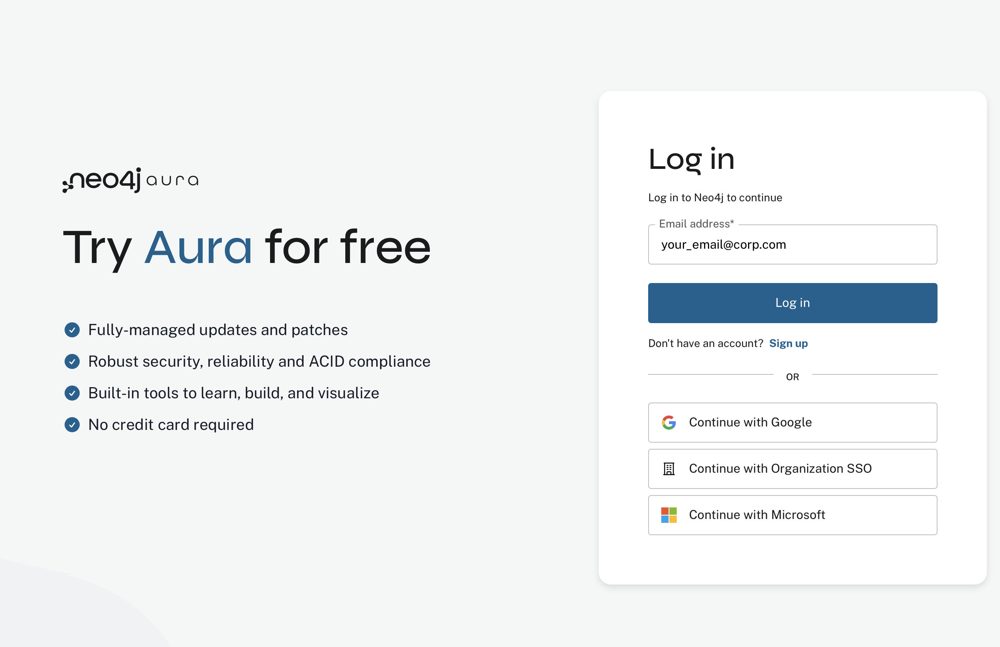
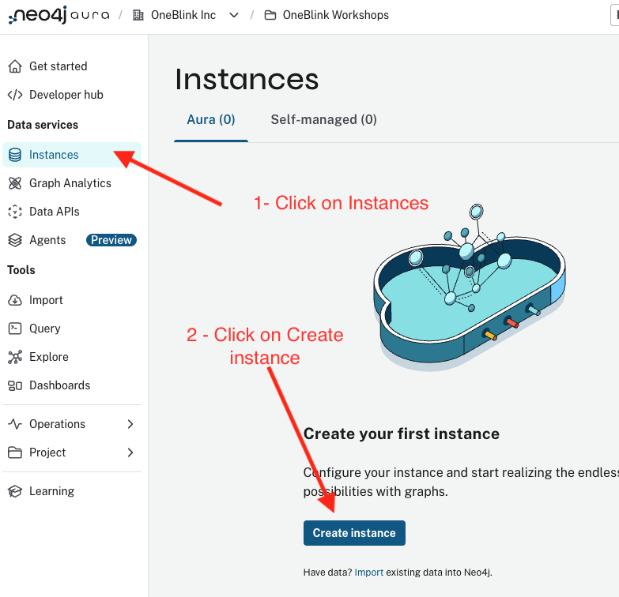
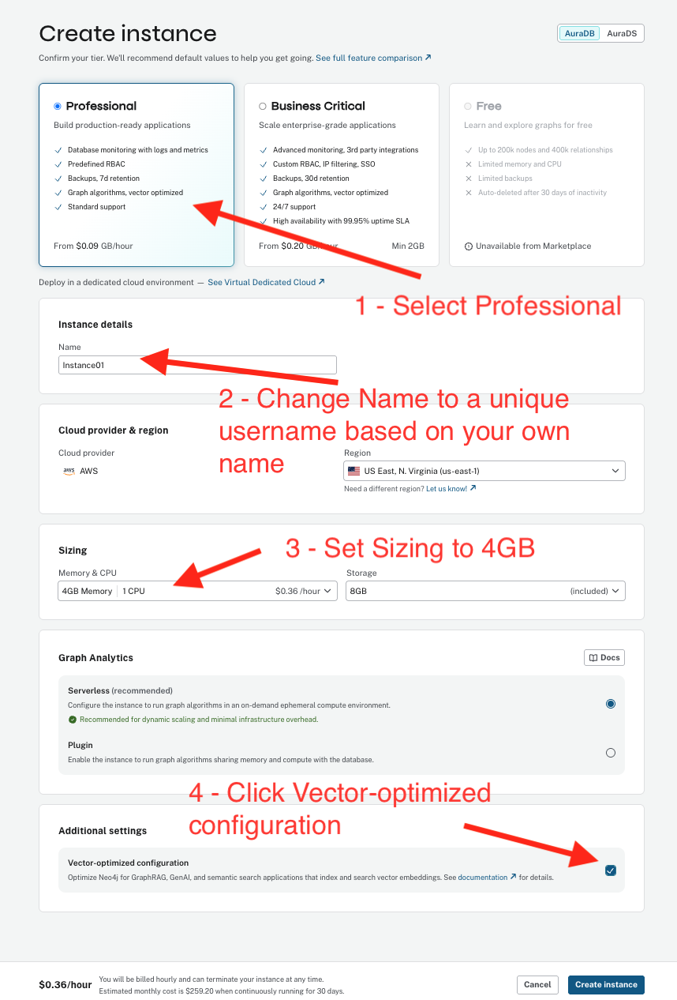
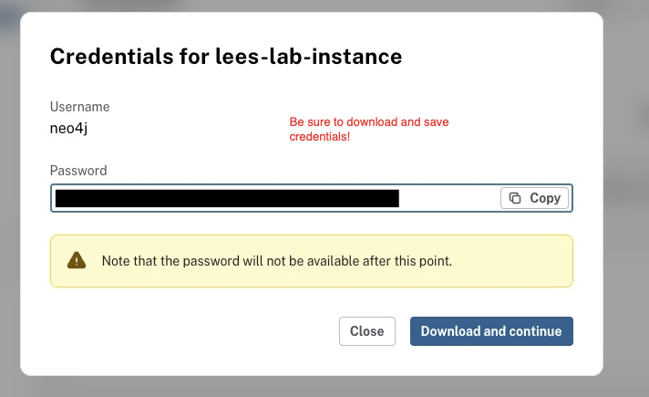
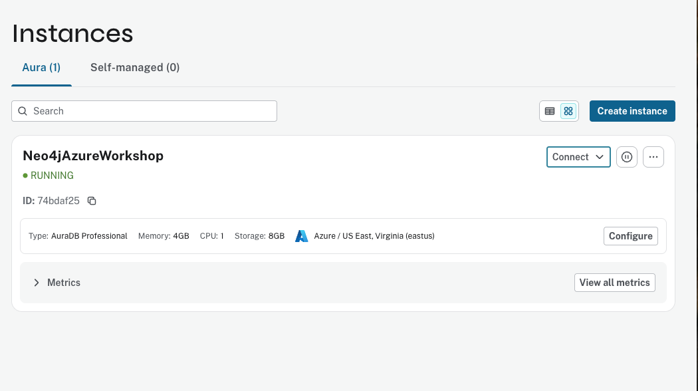

# Get Started with Neo4j Aura on AWS Marketplace

Follow these steps to subscribe to Neo4j Aura through the AWS Marketplace and create your first instance.

**Important:** Be sure to select an appropriate AWS region as shown in the configuration steps below. We recommend **US East (N. Virginia)** for optimal latency with Bedrock services.

## Step 1: Access the AWS Marketplace

Log in to the AWS Console at [console.aws.amazon.com](https://console.aws.amazon.com). In the search bar at the top, type **marketplace** and select **AWS Marketplace Subscriptions** from the results.

## Step 2: Find Neo4j Aura

Click **Discover products** to browse the AWS Marketplace. In the search bar, type **neo4j aura** and press Enter.

From the results, locate and select **Neo4j AuraDB Professional (Pay-As-You-Go)**.

## Step 3: Subscribe to Neo4j AuraDB Professional

Review the product details and pricing information. Click **Continue to Subscribe** to proceed.

Review the terms and conditions, then click **Accept Terms** to create your subscription.

Wait for the subscription to be processed. This typically takes 1-2 minutes.

## Step 4: Configure Your Account

After the subscription is active, click **Set Up Your Account** (or **Configure account now**) to connect to Neo4j Aura.

## Step 5: Create Your Neo4j Aura Account

You will be redirected to the Neo4j Aura login page.

**Important: Create a new account using your email address.** Do not use social login (Google, Microsoft) for workshop accounts, as this ensures proper linking with your AWS Marketplace subscription.

Click **Sign up** and enter your details:
- Email address (use your work email)
- Password (save this for later)

## Step 6: Select the Marketplace Organization

Once logged into Neo4j Aura:

1. Click on the organization dropdown in the top navigation (may show "New Organization")
2. Select the **Marketplace Organization** that is linked to your AWS subscription

This ensures your usage is billed through your AWS account.

## Step 7: Create an Instance

In the Aura console:

1. Navigate to **Instances** in the left sidebar
2. Click the **Create instance** button

## Step 8: Configure Your Instance

Configure your Neo4j Aura instance with the following settings:

| Setting | Value |
|---------|-------|
| **Tier** | Professional |
| **Instance name** | Choose a descriptive name (e.g., "Neo4j-AWS-Workshop") |
| **Cloud provider** | AWS |
| **Region** | US East (N. Virginia) - recommended for Bedrock |
| **Memory & CPU** | 4GB Memory / 1 CPU |
| **Graph Analytics** | Plugin (enables graph algorithms) |
| **Vector-optimized** | Enabled (for GraphRAG and semantic search) |

Click **Create** to provision your instance.

## Step 9: Save Your Credentials

**Critical Step:** After clicking Create, a credentials dialog will appear containing:
- Connection URI (neo4j+s://xxx.databases.neo4j.io)
- Username (neo4j)
- Password (auto-generated)

**Save this information immediately** - the password will not be shown again after you close this dialog.

Click **Download and continue** to save the credentials file, or copy each value manually.

You will need these credentials in:
- Lab 2: Aura Agents configuration
- Lab 3: Codespace environment setup
- Labs 3-7: Jupyter notebook configuration

## Verify Your Instance

Wait 2-3 minutes for your instance to start. Once running, you should see a green **Running** status.

Your Neo4j Aura database is now ready to use!

## AWS Billing Notes

- Neo4j Aura usage will appear on your AWS bill under "Marketplace"
- Billing is based on actual usage (memory/CPU hours)
- AWS credits can be applied to Neo4j Aura charges
- Stop your instance when not in use to minimize costs (or delete after the workshop)

## Troubleshooting

### Subscription stuck in "Pending"
- Wait a few more minutes; initial subscription can take 2-3 minutes
- Refresh the page
- Check you have Marketplace purchasing permissions

### Cannot see Marketplace Organization in Aura
- Ensure you signed up with the same email used for AWS
- Log out of Aura and log back in
- Contact Neo4j support if the issue persists

### Instance creation fails
- Check you selected a supported region
- Verify your subscription is active
- Try reducing instance size if quota issues occur

## Next Steps

Return to the [main lab instructions](README.md) to continue with Part 2: Loading the knowledge graph.
