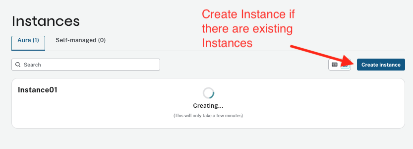

# Lab 1: Neo4j Aura Setup and Exploration

In this lab, you will set up your Neo4j Aura database, load a financial knowledge graph using Cypher, and explore your graph visually.

## Prerequisites

- Completed **Lab 0** (environment setup)
- For **Workshop SSO Login**: Access to OneBlink credentials page (provided by your organizer)
- For **Free Trial Signup**: A valid email address

## Part 1: Neo4j Aura Signup

There are two signup options for this lab. **Please follow the signup process provided by your workshop organizer.**

### Option A: Workshop SSO Login (Recommended for organized workshops)

If your organizer has provided OneBlink credentials, use the SSO login process:

- Follow the [Neo4j Aura SSO Login](SSO_Neo4j_Aura_Signup.md) guide to log in using your organization's SSO credentials
- This option uses pre-configured workshop accounts

### Option B: Free Trial Signup (For self-paced learning)

If you're completing this lab independently or your organizer has instructed you to create a free trial:

- Follow the [Neo4j Aura Free Trial Signup](Aura_Free_Trial.md) guide to create your own account
- This option provides a 14-day free trial with an automatically created instance

## Part 2: Create Your Database Instance

> **Note:** If you signed up using the **Free Trial** option (Option B), your instance was already created during the signup process. You can skip ahead to [Part 3: Load the Knowledge Graph](#part-3-load-the-knowledge-graph).

1. After logging in, click on **Instances** in the left sidebar under "Data services", then click the **Create instance** button.

   

   If you already have existing instances, click the **Create instance** button in the top-right corner of the Instances page.

   

2. Configure your new instance with the following settings:
   - Select the **Aura Professional** plan
   - Set the **Instance name** to a unique name based on your name (e.g., `ryans-lab-instance`). If you have an error try another unique name by adding your initials or a number.
   - Set the **Sizing** to **4 GB RAM / 1 CPU**
   - Enable **Vector-optimized configuration** under Additional settings

   

3. Click **Create** to provision your database instance.

4. **Save your connection credentials immediately.** When your instance is created, a dialog will appear showing your database credentials (Username and Password). Click **Download and continue** to save the credentials file.

   

> **CRITICAL:** The password is only shown once and will not be available after you close this dialog. Download the credentials file and store it somewhere safe. You will need these credentials in later labs to connect your applications to Neo4j.


## Part 3: Load the Knowledge Graph

After your Aura instance is running, open **Query** from the left sidebar in the [Aura Console](https://console.neo4j.io) and run the following Cypher statements in order.

### Step 1: Create Constraints

These ensure each node has a unique identifier and speed up MERGE lookups during loading.

```cypher
CREATE CONSTRAINT company_id IF NOT EXISTS
FOR (c:Company) REQUIRE c.companyId IS UNIQUE;

CREATE CONSTRAINT company_name IF NOT EXISTS
FOR (c:Company) REQUIRE c.name IS UNIQUE;

CREATE CONSTRAINT product_id IF NOT EXISTS
FOR (p:Product) REQUIRE p.productId IS UNIQUE;

CREATE CONSTRAINT risk_id IF NOT EXISTS
FOR (r:RiskFactor) REQUIRE r.riskId IS UNIQUE;

CREATE CONSTRAINT manager_id IF NOT EXISTS
FOR (m:AssetManager) REQUIRE m.managerId IS UNIQUE;
```

### Step 2: Load Nodes

Each statement reads a CSV file and creates (or updates) the corresponding nodes: Companies, Products, Risk Factors, and Asset Managers.

```cypher
LOAD CSV WITH HEADERS FROM 'https://dhoj7jltw73ew.cloudfront.net/sec-filings/companies.csv' AS row
MERGE (c:Company {companyId: row.company_id})
SET c.name = row.name, c.ticker = row.ticker,
    c.cik = row.cik, c.cusip = row.cusip;

LOAD CSV WITH HEADERS FROM 'https://dhoj7jltw73ew.cloudfront.net/sec-filings/products.csv' AS row
MERGE (p:Product {productId: row.product_id})
SET p.name = row.name, p.description = row.description;

LOAD CSV WITH HEADERS FROM 'https://dhoj7jltw73ew.cloudfront.net/sec-filings/risk_factors.csv' AS row
MERGE (r:RiskFactor {riskId: row.risk_id})
SET r.name = row.name, r.description = row.description;

LOAD CSV WITH HEADERS FROM 'https://dhoj7jltw73ew.cloudfront.net/sec-filings/asset_managers.csv' AS row
MERGE (m:AssetManager {managerId: row.manager_id})
SET m.name = row.name;
```

### Step 3: Load Relationships

Creates relationships between nodes: OFFERS (Company→Product), FACES_RISK (Company→RiskFactor), OWNS (AssetManager→Company), COMPETES_WITH and PARTNERS_WITH (Company→Company). The last two use MERGE on the target company name since competitors and partners may be companies mentioned in filings that aren't in the primary dataset.

```cypher
LOAD CSV WITH HEADERS FROM 'https://dhoj7jltw73ew.cloudfront.net/sec-filings/company_products.csv' AS row
MATCH (c:Company {companyId: row.company_id})
MATCH (p:Product {productId: row.product_id})
MERGE (c)-[:OFFERS]->(p);

LOAD CSV WITH HEADERS FROM 'https://dhoj7jltw73ew.cloudfront.net/sec-filings/company_risk_factors.csv' AS row
MATCH (c:Company {companyId: row.company_id})
MATCH (r:RiskFactor {riskId: row.risk_id})
MERGE (c)-[:FACES_RISK]->(r);

LOAD CSV WITH HEADERS FROM 'https://dhoj7jltw73ew.cloudfront.net/sec-filings/asset_manager_companies.csv' AS row
MATCH (m:AssetManager {managerId: row.manager_id})
MATCH (c:Company {companyId: row.company_id})
MERGE (m)-[:OWNS {shares: toInteger(row.shares)}]->(c);

LOAD CSV WITH HEADERS FROM 'https://dhoj7jltw73ew.cloudfront.net/sec-filings/company_competitors.csv' AS row
MATCH (a:Company {companyId: row.source_company_id})
MERGE (b:Company {name: row.target_company_name})
MERGE (a)-[:COMPETES_WITH]->(b);

LOAD CSV WITH HEADERS FROM 'https://dhoj7jltw73ew.cloudfront.net/sec-filings/company_partners.csv' AS row
MATCH (a:Company {companyId: row.source_company_id})
MERGE (b:Company {name: row.target_company_name})
MERGE (a)-[:PARTNERS_WITH]->(b);
```

### Step 4: Create Fulltext Index

This enables keyword search across entity names and descriptions.

```cypher
CREATE FULLTEXT INDEX search_entities IF NOT EXISTS
FOR (n:Company|Product|RiskFactor)
ON EACH [n.name, n.description];
```

### Step 5: Verify the Load

Run this query to confirm your node and relationship counts:

```cypher
MATCH (n)
WITH labels(n)[0] AS label, count(n) AS count
RETURN label, count ORDER BY label;
```

You should see approximately:

| Label | Count |
|---|---|
| AssetManager | 15 |
| Company | ~73 |
| Product | 91 |
| RiskFactor | 57 |

> **Note:** The Company count is higher than 6 because COMPETES_WITH and PARTNERS_WITH
> relationships reference companies mentioned in filings (e.g., Google, Samsung, OpenAI) that
> aren't themselves filing companies. These "mentioned companies" have a `name` but no
> `companyId`, `ticker`, or other identifiers. The 6 filing companies can be found with:
> ```cypher
> MATCH (c:Company) WHERE c.companyId IS NOT NULL RETURN c.name, c.ticker ORDER BY c.name;
> ```

### Step 6: Try Some Queries

Now that the graph is loaded, try these queries to explore the data.

**What products does NVIDIA offer?**

```cypher
MATCH (c:Company {ticker: 'NVDA'})-[:OFFERS]->(p:Product)
RETURN p.name ORDER BY p.name LIMIT 10;
```

**Which risk factors are shared across multiple companies?**

```cypher
MATCH (c:Company)-[:FACES_RISK]->(r:RiskFactor)
WITH r, collect(c.ticker) AS companies, count(c) AS cnt
WHERE cnt > 1
RETURN r.name, companies, cnt
ORDER BY cnt DESC LIMIT 5;
```

**Who are the top asset managers by number of holdings?**

```cypher
MATCH (am:AssetManager)-[o:OWNS]->(c:Company)
WITH am, count(c) AS holdings, sum(o.shares) AS total_shares
RETURN am.name, holdings, total_shares
ORDER BY holdings DESC LIMIT 5;
```

**Who does Microsoft compete with?**

```cypher
MATCH (c:Company {ticker: 'MSFT'})-[:COMPETES_WITH]->(comp)
RETURN comp.name ORDER BY comp.name;
```

**Which risk factors expose an asset manager's portfolio across multiple companies?**

```cypher
MATCH (am:AssetManager)-[:OWNS]->(c:Company)-[:FACES_RISK]->(r:RiskFactor)
WITH am, r, count(DISTINCT c) AS exposed
WHERE exposed > 1
RETURN am.name, r.name, exposed
ORDER BY exposed DESC, am.name LIMIT 5;
```

**Who are NVIDIA's supply chain partners?**

```cypher
MATCH (c:Company {ticker: 'NVDA'})-[:PARTNERS_WITH]->(p)
RETURN p.name ORDER BY p.name;
```

## Part 4: Explore the Knowledge Graph

Follow [EXPLORE.md](EXPLORE.md) to:

1. Use Neo4j Explore to visually navigate your graph
2. Search for patterns between asset managers, companies, and risk factors
3. Apply graph algorithms like Degree Centrality
4. Identify key entities through visual analysis

## Next Steps

After completing this lab, continue to [Lab 2 - Aura Agents](../Lab_2_Aura_Agents) to build an AI-powered agent using the Neo4j Aura Agent no-code platform.
