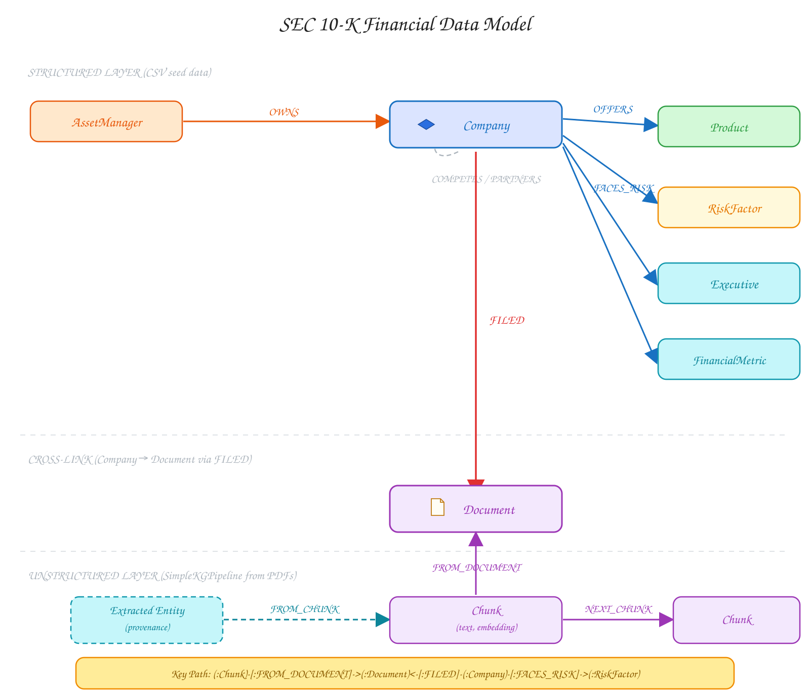

# Lab 1: Neo4j Aura Setup and Exploration

In this lab, you will set up your Neo4j Aura database, load a complete financial knowledge graph (structured entities, relationships, and document chunks with vector embeddings) using Cypher, and explore your graph visually. After this lab the graph is ready for every downstream lab; no further data loading is required.

> **⚠️ Important: Save your Aura credentials.** When you create your Aura instance, the Connection URI, Username, and Password are shown only once. **Download and keep them.** Every coding lab (Labs 3 through 6) reads these values from the `CONFIG.txt` file at the repository root, which you fill in after cloning the repo in the Part 2 setup. Losing the password means recreating the instance.

## Prerequisites

- Completed **Lab 0** (Sign In to AWS)
- A valid email address

## Part 1: Neo4j Aura Signup

Follow the [Neo4j Aura Free Signup](Aura_Free_Trial.md) guide to create your free Aura account and database instance.


## Part 2: Load the Knowledge Graph



After your Aura instance is running, open **Query** from the left sidebar in the [Aura Console](https://console.neo4j.io) and run the following Cypher statements in order.

### Step 1: Create Constraints

These ensure each node has a unique identifier and speed up MERGE lookups during loading.

```cypher
CREATE CONSTRAINT companyId IF NOT EXISTS
FOR (c:Company) REQUIRE c.companyId IS UNIQUE;

CREATE CONSTRAINT companyName IF NOT EXISTS
FOR (c:Company) REQUIRE c.name IS UNIQUE;

CREATE CONSTRAINT productId IF NOT EXISTS
FOR (p:Product) REQUIRE p.productId IS UNIQUE;

CREATE CONSTRAINT riskId IF NOT EXISTS
FOR (r:RiskFactor) REQUIRE r.riskId IS UNIQUE;

CREATE CONSTRAINT managerId IF NOT EXISTS
FOR (m:AssetManager) REQUIRE m.managerId IS UNIQUE;

CREATE CONSTRAINT documentId IF NOT EXISTS
FOR (d:Document) REQUIRE d.documentId IS UNIQUE;

CREATE CONSTRAINT metricId IF NOT EXISTS
FOR (fm:FinancialMetric) REQUIRE fm.metricId IS UNIQUE;

CREATE CONSTRAINT chunkId IF NOT EXISTS
FOR (c:Chunk) REQUIRE c.chunkId IS UNIQUE;
```

### Step 2: Load Nodes

Each statement reads a CSV file and creates (or updates) the corresponding nodes: Companies, Products, Risk Factors, Asset Managers, Documents, and Financial Metrics.

```cypher
LOAD CSV WITH HEADERS FROM 'https://dhoj7jltw73ew.cloudfront.net/sec-filings/companies.csv' AS row
MERGE (c:Company {companyId: row.companyId})
SET c.name = row.name, c.ticker = row.ticker,
    c.cik = row.cik, c.cusip = row.cusip;

LOAD CSV WITH HEADERS FROM 'https://dhoj7jltw73ew.cloudfront.net/sec-filings/products.csv' AS row
MERGE (p:Product {productId: row.productId})
SET p.name = row.name, p.description = row.description;

LOAD CSV WITH HEADERS FROM 'https://dhoj7jltw73ew.cloudfront.net/sec-filings/risk_factors.csv' AS row
MERGE (r:RiskFactor {riskId: row.riskId})
SET r.name = row.name, r.description = row.description;

LOAD CSV WITH HEADERS FROM 'https://dhoj7jltw73ew.cloudfront.net/sec-filings/asset_managers.csv' AS row
MERGE (m:AssetManager {managerId: row.managerId})
SET m.name = row.name;

LOAD CSV WITH HEADERS FROM 'https://dhoj7jltw73ew.cloudfront.net/sec-filings/documents.csv' AS row
MERGE (d:Document {documentId: row.documentId})
SET d.accessionNumber = row.accessionNumber, d.filingType = row.filingType,
    d.source = row.source;

LOAD CSV WITH HEADERS FROM 'https://dhoj7jltw73ew.cloudfront.net/sec-filings/financial_metrics.csv' AS row
MERGE (fm:FinancialMetric {metricId: row.metricId})
SET fm.name = row.name, fm.value = row.value, fm.period = row.period;
```

### Step 3: Load Relationships

Creates relationships between nodes: OFFERS (Company→Product), FACES_RISK (Company→RiskFactor), OWNS (AssetManager→Company), COMPETES_WITH and PARTNERS_WITH (Company→Company), FILED (Company→Document), and REPORTS (Company→FinancialMetric). The competitor and partner loads use MERGE on the target company name, which creates new Company nodes for names not already in `companies.csv`.

```cypher
LOAD CSV WITH HEADERS FROM 'https://dhoj7jltw73ew.cloudfront.net/sec-filings/company_products.csv' AS row
MATCH (c:Company {companyId: row.companyId})
MATCH (p:Product {productId: row.productId})
MERGE (c)-[:OFFERS]->(p);

LOAD CSV WITH HEADERS FROM 'https://dhoj7jltw73ew.cloudfront.net/sec-filings/company_risk_factors.csv' AS row
MATCH (c:Company {companyId: row.companyId})
MATCH (r:RiskFactor {riskId: row.riskId})
MERGE (c)-[:FACES_RISK]->(r);

LOAD CSV WITH HEADERS FROM 'https://dhoj7jltw73ew.cloudfront.net/sec-filings/asset_manager_companies.csv' AS row
MATCH (m:AssetManager {managerId: row.managerId})
MATCH (c:Company {companyId: row.companyId})
MERGE (m)-[:OWNS {shares: toInteger(row.shares)}]->(c);

LOAD CSV WITH HEADERS FROM 'https://dhoj7jltw73ew.cloudfront.net/sec-filings/company_competitors.csv' AS row
MATCH (a:Company {companyId: row.sourceCompanyId})
MERGE (b:Company {name: row.targetCompanyName})
MERGE (a)-[:COMPETES_WITH]->(b);

LOAD CSV WITH HEADERS FROM 'https://dhoj7jltw73ew.cloudfront.net/sec-filings/company_partners.csv' AS row
MATCH (a:Company {companyId: row.sourceCompanyId})
MERGE (b:Company {name: row.targetCompanyName})
MERGE (a)-[:PARTNERS_WITH]->(b);

LOAD CSV WITH HEADERS FROM 'https://dhoj7jltw73ew.cloudfront.net/sec-filings/company_documents.csv' AS row
MATCH (c:Company {companyId: row.companyId})
MATCH (d:Document {documentId: row.documentId})
MERGE (c)-[:FILED]->(d);

LOAD CSV WITH HEADERS FROM 'https://dhoj7jltw73ew.cloudfront.net/sec-filings/company_financial_metrics.csv' AS row
MATCH (c:Company {companyId: row.companyId})
MATCH (fm:FinancialMetric {metricId: row.metricId})
MERGE (c)-[:REPORTS]->(fm);
```

### Step 4: Load Document Chunks and Embeddings

So far you have loaded the **structured layer** — companies, products, risk factors, and the relationships between them. Now you add the **unstructured layer**: the SEC filing text split into chunks, each carrying a pre-computed 1024-dimensional embedding.

This statement reads `chunks.csv`, where the embedding is stored as a semicolon-delimited list of floats, rebuilds it into a vector with `split()`/`toFloat()`, and attaches it to each Chunk node. The load is batched with `CALL (row) { ... } IN TRANSACTIONS` because the file is large (~9 MB).

> **Run this statement on its own.** `CALL (row) { ... } IN TRANSACTIONS` must execute as a single auto-committing query, so paste and run only this block (not alongside other statements). It may take a few seconds to complete.

```cypher
LOAD CSV WITH HEADERS FROM 'https://dhoj7jltw73ew.cloudfront.net/sec-filings/chunks.csv' AS row
CALL (row) {
    MERGE (c:Chunk {chunkId: row.chunkId})
    SET c.index = toInteger(row.index), c.text = row.text
    WITH c, [x IN split(row.embedding, ';') | toFloat(x)] AS emb
    CALL db.create.setNodeVectorProperty(c, 'embedding', emb)
} IN TRANSACTIONS OF 50 ROWS;
```

> **Note:** These embeddings were generated with Amazon Titan Text Embeddings V2 (1024 dimensions). Your query-time embedder in later labs uses the same model, so vector search matches correctly.

### Step 5: Create the Vector Index

Create a vector index on the Chunk embeddings. This uses cosine similarity and enables fast approximate nearest-neighbor search in the GraphRAG labs.

```cypher
CREATE VECTOR INDEX chunkEmbeddings IF NOT EXISTS
FOR (c:Chunk) ON (c.embedding)
OPTIONS {indexConfig: {
    `vector.dimensions`: 1024,
    `vector.similarity_function`: 'cosine'
}};
```

### Step 6: Link Chunks to the Graph

Connect the chunks to the structured graph. `FROM_DOCUMENT` ties each chunk to its source filing, `NEXT_CHUNK` preserves reading order, and `FROM_CHUNK` links Products, Risk Factors, Financial Metrics, and Companies to the chunks that mention them. These cross-links are what make GraphRAG powerful: a vector search finds relevant chunks, then graph traversal reaches the connected entities.

```cypher
LOAD CSV WITH HEADERS FROM 'https://dhoj7jltw73ew.cloudfront.net/sec-filings/chunk_documents.csv' AS row
MATCH (c:Chunk {chunkId: row.chunkId})
MATCH (d:Document {documentId: row.documentId})
MERGE (c)-[:FROM_DOCUMENT]->(d);

LOAD CSV WITH HEADERS FROM 'https://dhoj7jltw73ew.cloudfront.net/sec-filings/chunk_sequence.csv' AS row
MATCH (curr:Chunk {chunkId: row.chunkId})
MATCH (next:Chunk {chunkId: row.nextChunkId})
MERGE (curr)-[:NEXT_CHUNK]->(next);

LOAD CSV WITH HEADERS FROM 'https://dhoj7jltw73ew.cloudfront.net/sec-filings/entity_chunks.csv' AS row
FILTER row.entityType = 'Product'
MATCH (e:Product {productId: row.entityId})
MATCH (c:Chunk {chunkId: row.chunkId})
MERGE (e)-[:FROM_CHUNK]->(c);

LOAD CSV WITH HEADERS FROM 'https://dhoj7jltw73ew.cloudfront.net/sec-filings/entity_chunks.csv' AS row
FILTER row.entityType = 'RiskFactor'
MATCH (e:RiskFactor {riskId: row.entityId})
MATCH (c:Chunk {chunkId: row.chunkId})
MERGE (e)-[:FROM_CHUNK]->(c);

LOAD CSV WITH HEADERS FROM 'https://dhoj7jltw73ew.cloudfront.net/sec-filings/entity_chunks.csv' AS row
FILTER row.entityType = 'FinancialMetric'
MATCH (e:FinancialMetric {metricId: row.entityId})
MATCH (c:Chunk {chunkId: row.chunkId})
MERGE (e)-[:FROM_CHUNK]->(c);

LOAD CSV WITH HEADERS FROM 'https://dhoj7jltw73ew.cloudfront.net/sec-filings/entity_chunks.csv' AS row
FILTER row.entityType = 'Company'
MATCH (e:Company {companyId: row.entityId})
MATCH (c:Chunk {chunkId: row.chunkId})
MERGE (e)-[:FROM_CHUNK]->(c);
```

### Step 7: Create Fulltext Index

This enables keyword search across entity names and descriptions.

```cypher
CREATE FULLTEXT INDEX search_entities IF NOT EXISTS
FOR (n:Company|Product|RiskFactor)
ON EACH [n.name, n.description];
```

### Step 8: Verify the Load

Run this query to confirm your node and relationship counts:

```cypher
MATCH (n)
WITH labels(n)[0] AS label, count(n) AS count
RETURN label, count ORDER BY label;
```

You should see approximately:

| Label | Count |
|---|---|
| AssetManager | 15 |
| Chunk | 346 |
| Company | ~71 |
| Document | 7 |
| FinancialMetric | 874 |
| Product | 303 |
| RiskFactor | 883 |

Then confirm the chunk relationships loaded:

```cypher
MATCH ()-[r]->()
WITH type(r) AS type, count(r) AS count
RETURN type, count ORDER BY type;
```

You should see `FROM_DOCUMENT`, `NEXT_CHUNK`, and `FROM_CHUNK` alongside the structured relationships (`OFFERS`, `FACES_RISK`, `OWNS`, `COMPETES_WITH`, `PARTNERS_WITH`, `FILED`, `REPORTS`). Finally, confirm the vector index is online:

```cypher
SHOW VECTOR INDEXES;
```

The `chunkEmbeddings` index should be listed with a `state` of `ONLINE`.

> **Note:** The Company count is higher than 6 because `company_competitors.csv` and
> `company_partners.csv` contain competitor and partner names (e.g., Google, Samsung, OpenAI)
> that aren't in `companies.csv`. The relationship loads use
> `MERGE (b:Company {name: row.targetCompanyName})`, which creates new Company nodes for
> these names. The resulting nodes have only a `name` property — no `companyId`, `ticker`,
> or other identifiers. The 6 filing companies can be found with:
> ```cypher
> MATCH (c:Company) WHERE c.companyId IS NOT NULL RETURN c.name, c.ticker ORDER BY c.name;
> ```

### Step 9: Try Some Queries

Now that the graph is loaded, try these queries to explore the data.

**What products does NVIDIA offer?**

```cypher
MATCH (c:Company {ticker: 'NVDA'})-[:OFFERS]->(p:Product)
WHERE p.name IS NOT NULL
RETURN p.name ORDER BY p.name LIMIT 10;
```

**Which risk factors are shared across multiple companies?**

```cypher
MATCH (c:Company)-[:FACES_RISK]->(r:RiskFactor)
WITH r, collect(c.ticker) AS companies, count(c) AS cnt
WHERE cnt > 1
RETURN r.name, companies, cnt
ORDER BY cnt DESC LIMIT 5;
```

**Who are the top asset managers by number of holdings?**

```cypher
MATCH (am:AssetManager)-[o:OWNS]->(c:Company)
WITH am, count(c) AS holdings, sum(o.shares) AS total_shares
RETURN am.name, holdings, total_shares
ORDER BY holdings DESC LIMIT 5;
```

**Who does Microsoft compete with?**

```cypher
MATCH (c:Company {ticker: 'MSFT'})-[:COMPETES_WITH]->(comp:Company)
WHERE comp.name IS NOT NULL
RETURN comp.name ORDER BY comp.name;
```

**Which risk factors expose an asset manager's portfolio across multiple companies?**

```cypher
MATCH (am:AssetManager)-[:OWNS]->(c:Company)-[:FACES_RISK]->(r:RiskFactor)
WITH am, r, count(DISTINCT c) AS exposed
WHERE exposed > 1 AND am.name IS NOT NULL
RETURN am.name, r.name, exposed
ORDER BY exposed DESC, am.name LIMIT 5;
```

**Who are NVIDIA's supply chain partners?**

```cypher
MATCH (c:Company {ticker: 'NVDA'})-[:PARTNERS_WITH]->(p:Company)
WHERE p.name IS NOT NULL
RETURN p.name ORDER BY p.name;
```

## Part 3: Explore the Knowledge Graph

Follow [EXPLORE.md](EXPLORE.md) to:

1. Use Neo4j Explore to visually navigate your graph
2. Search for patterns between asset managers, companies, and risk factors
3. Apply graph algorithms like Degree Centrality
4. Identify key entities through visual analysis

## Next Steps

After completing this lab, continue to [Lab 2 - Data Pipeline](../Lab_2_Data_Pipeline) (optional) to see how the graph's chunk embeddings are generated, or go straight to [Lab 3 - Semantic Search and GraphRAG](../Lab_3_GraphRAG_Search) to begin building GraphRAG retrieval over this knowledge graph.
