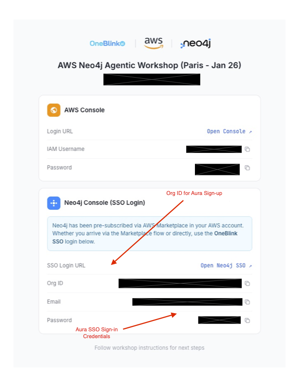
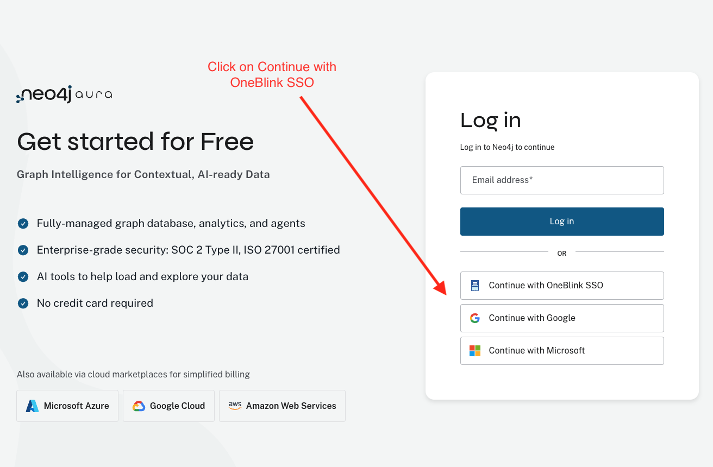

# Neo4j Aura SSO Login

To access the Neo4j Aura Console using SSO, open an **incognito/private browser window** and follow these steps:

1. Navigate to the OneBlink credentials page to retrieve your SSO login information. You will find the **Org ID**, **Email**, and **Password** in the Neo4j Console (SSO Login) section.

   

2. Go to [https://console-preview.neo4j.io/](https://console-preview.neo4j.io/)

3. On the Neo4j Aura login page, click **"Continue with Organization SSO"** in the login options panel on the right side.

   

4. Enter the **Org ID** from your OneBlink credentials page, then click **"Continue with OneBlink SSO"**.

   

5. Enter your **Email** and **Password** from the OneBlink credentials page on the authentication page.

6. After successful authentication, you will be redirected to the Neo4j Aura Console where you can manage your database instances.

---

**Next:** Return to the [Lab 1 README](README.md#create-your-database-instance) to continue setting up your database instance.
