# Lab 3 - Building AI Agents with Amazon Bedrock and SageMaker

This lab sets up your SageMaker development environment, walks through building a basic AI agent with the Strands Agents SDK and Amazon Bedrock, and then deploys it to AgentCore Runtime.

## What You'll Learn

- **Amazon Bedrock**: Configure and invoke foundation models from SageMaker notebooks
- **Strands Agents SDK**: Build agents with AWS's open-source, model-first agent framework
- **Tool Definition**: Define Python functions that an LLM can call with the `@tool` decorator
- **ReAct Pattern**: Reason, act, observe, and repeat — handled automatically by the Strands agent loop
- **AgentCore Deployment**: Package and deploy an agent to managed AWS runtime
- **Agent Invocation**: Call a deployed agent via CLI and boto3

## SageMaker Studio Setup

### Step 1: Navigate to SageMaker AI

1. In the AWS Management Console, click the **region selector** in the upper right corner and select **US East (N. Virginia)** / `us-east-1`
2. In the search bar at the top, type `SageMaker`
3. **Important:** Select **Amazon SageMaker AI** from the results (not "Amazon SageMaker" - they are different services!)

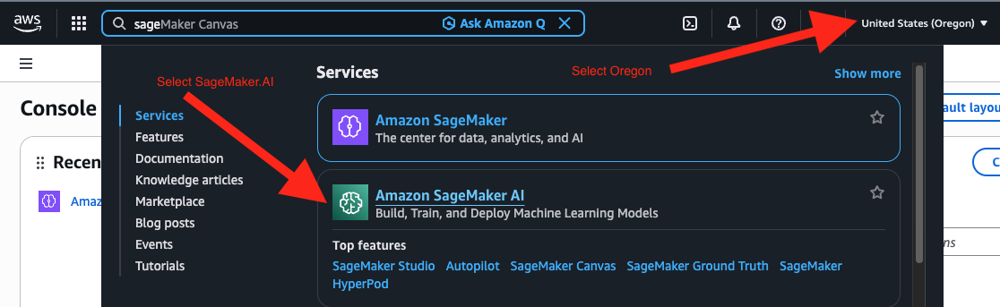

### Step 2: Set up a Domain

1. Verify you see **Amazon SageMaker AI** in the left sidebar (not just "Amazon SageMaker")
2. In the left panel under "Environment configuration", click on **Domains**, then click the **Create domain** button in the top right corner.

   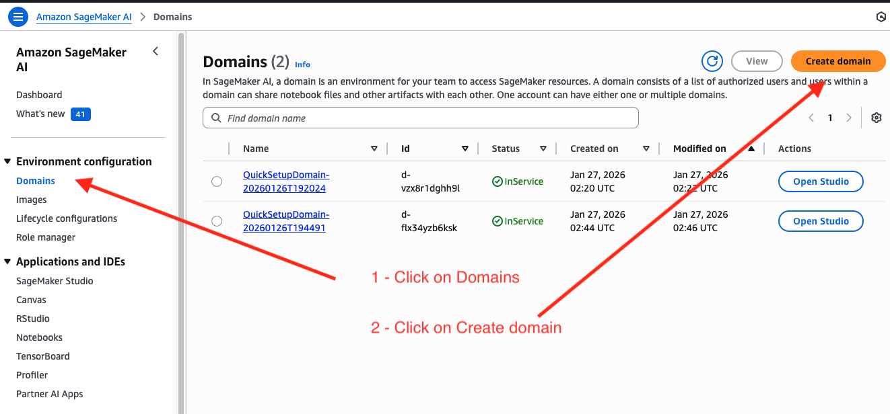

3. Select **Set up for single user (Quick setup)** on the left, then click the **Set up** button. This creates a domain with default settings perfect for getting started.

   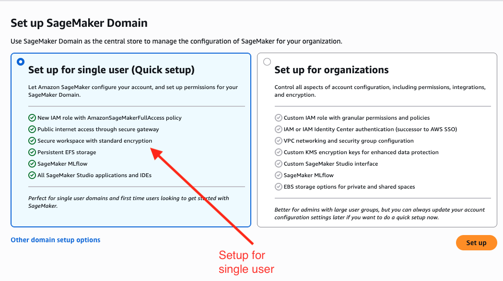

### Step 3: Open SageMaker Studio

1. Wait while your environment is being set up (this takes 1-2 minutes)
2. You'll see progress indicators for IAM role creation, internet access, encryption, and storage
3. Once setup completes, click **Open Studio** at the bottom of the page

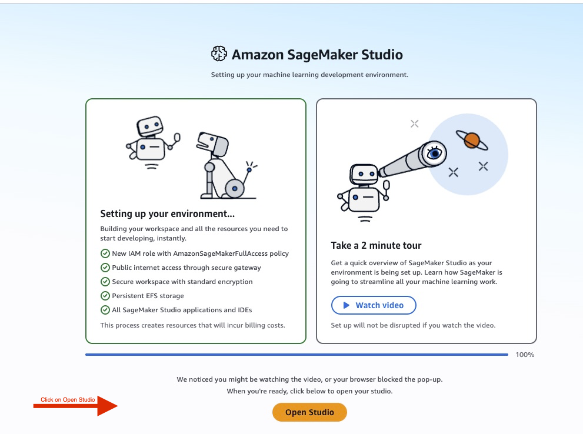

### Step 4: Launch JupyterLab

1. In SageMaker Studio Home, you'll see the Overview tab with different workflow options
2. Click on the **JupyterLab** card - this lets you create and run Jupyter notebooks in a dedicated environment

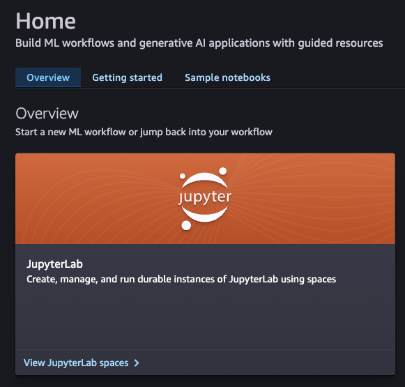

### Step 5: Create a JupyterLab Space

1. Under **Space templates**, find the **Quick start** option (ml.t3.medium - 5 GB - 4 GiB RAM)
2. Click **Launch now** to create a lightweight development environment perfect for this lab

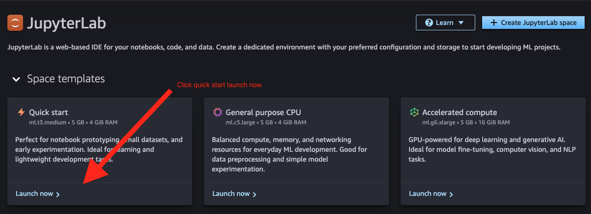

### Step 6: Open Your Space

1. Wait for the **Status** column to show **Running** (this may take 1-2 minutes)
2. Once running, click on the space name (e.g., **quickstart-default-t...**) in the Name column to open JupyterLab

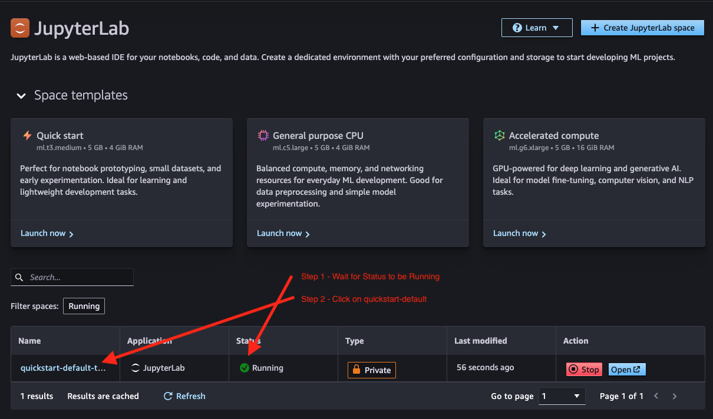

### Step 7: Create a Labs Folder

1. In the JupyterLab file browser on the left, click the **Create New Folder** icon (folder with a + sign)
2. Name the folder `labs` and press Enter
3. Double-click the **labs** folder to open it

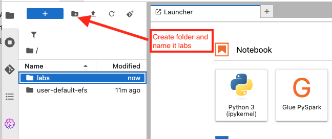

### Step 8: Clone the Git Repository

1. With the `labs` folder open, click on the **Git icon** in the left sidebar (it looks like a diamond/branch symbol)
2. If a **Clone a Repository** button is visible, click it and enter the repository URL:
   ```
   https://github.com/neo4j-partners/lab-neo4j-aws.git
   ```
   If the clone button is not available, open a terminal instead:
   1. In the JupyterLab Launcher, click **Terminal** under the **Other** section
   2. Run these commands to clone the repository into your labs folder:
      ```bash
      git clone https://github.com/neo4j-partners/lab-neo4j-aws.git
      ```
3. Once the clone completes, click the **file browser icon** (folder icon) in the left sidebar to navigate into the `labs/lab-neo4j-aws` directory

## Notebook 1: Build and Test the Agent

1. Open [01_basic_strands_agent.ipynb](01_basic_strands_agent.ipynb) in this lab folder
2. The notebook loads configuration from `../CONFIG.txt` (MODEL_ID and REGION)
3. Run through the cells to:
   - Install required packages
   - Define simple tools (get_current_time, add_numbers)
   - Create a Strands agent with BedrockModel
   - Test the agent with sample queries
   - Ask questions about sample SEC financial filing data

## Notebook 2: Deploy to AgentCore Runtime

1. Open [02_deploy_to_agentcore.ipynb](02_deploy_to_agentcore.ipynb)
2. The agent code is pre-built in the `agentcore_deploy/` directory
3. Run through the cells to:
   - Review the deployment package (agent.py and pyproject.toml)
   - Configure and deploy the agent to AgentCore Runtime
   - Invoke the deployed agent via CLI and boto3

## Explore AgentCore in the Console

After deploying the agent from the second notebook, you can view and test it directly in the AWS console.

### Step 1: Navigate to AgentCore

1. In the AWS console search bar, type `agentcore`
2. Select **Amazon Bedrock AgentCore** from the results

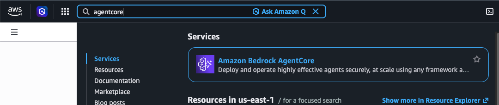

### Step 2: View Your Deployed Agent

1. In the left sidebar under **Build**, click **Runtime**
2. You'll see the **basic_strands_agent** listed under Runtime resources with a **Ready** status

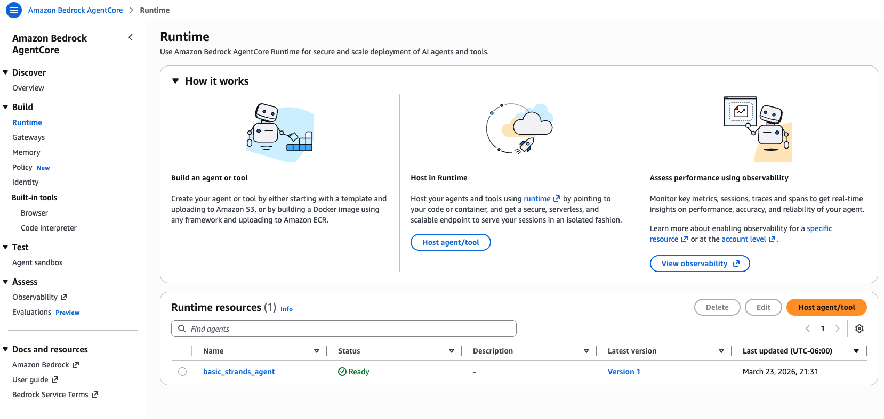

### Step 3: Review Versions and Observability

1. Click on the agent name to view its details
2. The **Versions** section shows a snapshot created with each deployment, letting you track changes and roll back if needed
3. The **Observability** section displays runtime metrics — invocation count, errors, latency, and memory consumption

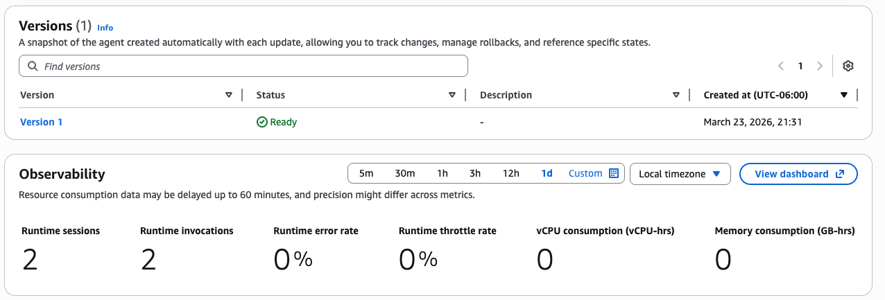

### Step 4: Test in the Agent Sandbox

As an alternative to invoking the agent via CLI or boto3 in the notebook, you can test it interactively in the console.

1. In the left sidebar under **Test**, click **Agent sandbox**
2. Select **basic_strands_agent** as the Runtime agent and **DEFAULT** as the Endpoint
3. Enter a JSON payload in the Input field, for example:
   ```json
   {"prompt": "What time is it and what is 42 + 17?"}
   ```
4. Click **Run** to invoke the agent and see the response in the Output section

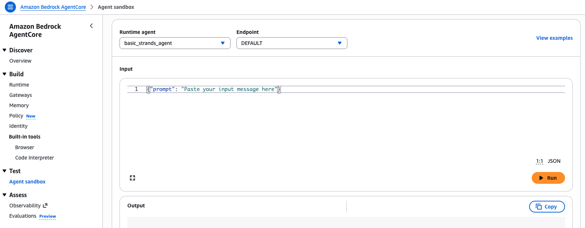

## Next Steps

Continue to [Lab 4 - GraphRAG Retrievers](../Lab_4_GraphRAG_Search) to load chunk embeddings and search a Neo4j knowledge graph with vector and vector-cypher retrieval.
