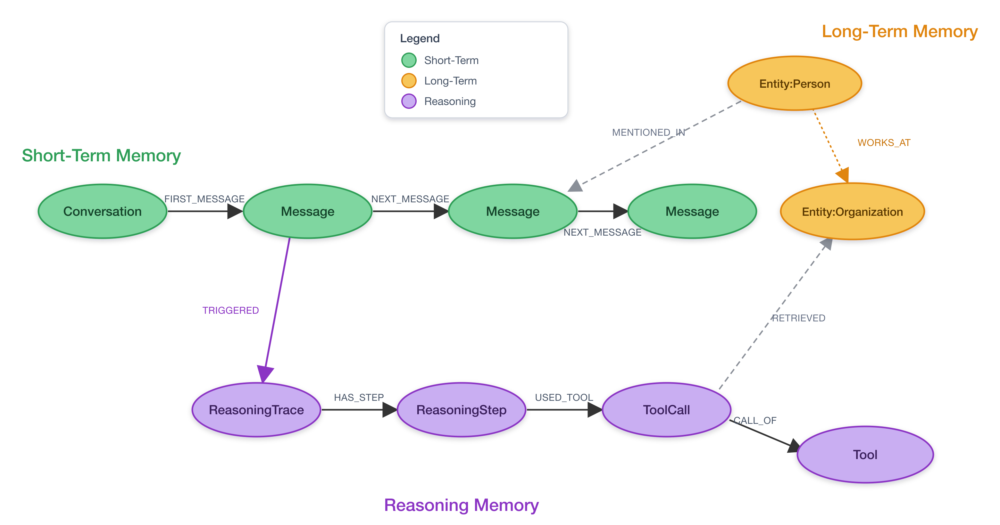

<style>
section {
  --marp-auto-scaling-code: false;
}

li {
  opacity: 1 !important;
  animation: none !important;
  visibility: visible !important;
}

/* Disable all fragment animations */
.marp-fragment {
  opacity: 1 !important;
  visibility: visible !important;
}

ul > li,
ol > li {
  opacity: 1 !important;
}
</style>

# Agent Memory with Neo4j

Three Kinds of Memory in One Graph

<!--
This deck covers the model behind agent memory: three connected kinds of
memory, stored as one graph. We focus on the memory concepts, not any managed
memory product.
-->

---

## What This Covers

- **Agents are amnesiacs:** flat context windows forget the plan
- **Three connected layers:** short-term, long-term, reasoning
- **Context graph:** captures the "why," not just the "what"
- **Reasoning traces:** first-class nodes make agents auditable
- **One graph:** memory sits beside the knowledge graph

<!--
Five ideas anchor the whole talk. Agents forget between calls. The fix is
structured memory in three connected layers. Together those layers form a
context graph that records reasoning, not just actions. And it all lives in one
Neo4j instance next to the domain knowledge graph.
-->

---

## Why Stateless Agents Fail

A stateless GraphRAG agent answers each question in isolation.

**Ask two questions in a row:**

1. "Tell me about Apple's risk factors."
2. "What about their competitors?"

- **The gap:** "their" has nothing to resolve against
- **Vector recall is not enough:** similarity gives recall, not understanding

<!--
The second question never names Apple. Continuity lived only in the model's
context window, which resets every call. Stuffing transcripts back in works
until the conversation gets long and facts contradict. Vector search over a
pile of chunks gives you recall by similarity, but not a structured
understanding of what connects to what.
-->

---

## Agent Memory and Context Graphs

- **Agent memory:** durable, queryable record of what an agent knows and has done
- **Context graph:** a knowledge graph that captures decision traces, grounded in real entities
- **The relationship:** the context graph *is* the memory, unified across three layers
- **"Sim City" model:** query any layer alone or all at once, scale each independently

<!--
Agent memory and context graph are two names for the same thing at different
altitudes. Memory is the capability; the context graph is how you model it.
Jim Webber calls the composable version a Sim City data model: three graphs
that connect, but that you can store, query, and scale on their own.
-->

---

## Three Kinds of Memory

- **Short-term:** conversation and session history
- **Long-term:** durable entities, facts, and preferences
- **Reasoning:** decision traces and tool calls

All three connected as nodes in **one graph**.

<!--
This is the framework for the rest of the deck. Short-term is the conversation.
Long-term is the knowledge the agent accumulates about the world. Reasoning is
the record of how it solved things. The next slide shows how they link.
-->

---



<!--
The green chain is short-term memory: a Conversation and its Messages. Orange is
long-term memory: entities like Person and Organization joined by typed
relationships such as WORKS_AT. Purple is reasoning memory: a Message triggers a
ReasoningTrace, which has steps, which use tool calls. Dashed edges cross the
layers: a Message mentions an entity, a ToolCall retrieved an entity. One graph,
three colors.
-->

---

## Short-Term Memory

- **Scope:** one conversation, keyed by `session_id`
- **Schema:** `(Conversation)-[:FIRST_MESSAGE]->(Message)-[:NEXT_MESSAGE]->(Message)`
- **Recalled by:** `get_context(session_id=...)`
- **Role:** bridges general knowledge and the current task

<!--
Short-term memory is ordered conversation turns scoped to a session. It is what
resolves "their" to Apple. It also gives multi-agent systems a shared view of
what each agent is currently working on.
-->

---

## Long-Term Memory

- **Holds:** durable entities, facts, preferences across sessions
- **POLE+O entities:** Person, Organization, Location, Event, Object
- **Typed relationships:** `(Entity:Person)-[:WORKS_AT]->(Entity:Organization)`
- **Deduplicated:** the same entity resolves to one node

<!--
Long-term memory is the knowledge graph the agent grows. Entities are classified
with the POLE+O model and joined by typed relationships. It maps to what the
literature calls semantic memory. Entity resolution keeps John Mercer one node,
not five. This is where memory augments the model's lossy training with curated
ground truth.
-->

---

## Reasoning Memory and Traces

- **Reasoning memory:** decision traces and tool calls as first-class nodes
- **Schema:** `(Message)-[:TRIGGERED]->(ReasoningTrace)-[:HAS_STEP]->(ReasoningStep)`
- **Tool use:** `(ReasoningStep)-[:USED_TOOL]->(ToolCall)-[:CALL_OF]->(Tool)`
- **Provenance:** a `ToolCall` links back with `RETRIEVED` to the entity it touched
- **Why:** answers "why did the agent decide this?"

<!--
This is the layer the old deck was missing. Reasoning traces are not log lines,
they are graph nodes with typed edges to the entities and messages that informed
each decision. That is what turns an agent from a black box into an auditable
system, the question regulators always ask.
-->

---

## One Graph, Connected Layers

Traverse across all three layers in one query:

```
(Message) -[:MENTIONED_IN]-> (Entity) <-[:RETRIEVED]- (ToolCall)
```

- **Deterministic:** graph traversal, not a similarity threshold
- **Provenance chain:** one agent's reasoning links to another's findings

<!--
Because the layers share one graph, you can walk from a message to the entity it
mentioned to the tool call that retrieved it. That traversal is guaranteed, not
probabilistic. In multi-agent setups every agent reads and writes the same
graph, so a flag one agent raises is visible to the next with no message
passing.
-->

---

## Best Practices

- **Design memory explicitly:** separate working from durable state
- **Capture the why:** reasoning and causal chains, not just actions
- **Traces as first-class nodes:** for explainability and audit
- **Deduplicate entities:** exact, then fuzzy, then semantic
- **Curate and compress:** messages to observations to a reflection

<!--
Treat memory as a first-class part of the architecture. Store durable state in a
form you can query, audit, and update. Keep reasoning as graph nodes. Resolve
duplicate entities with a cascade. And compress continuously so memory does not
grow without bound: raw messages summarize into observations, observations into
a single active reflection.
-->

---

## Where Memory Fits the Agent Strategy

| Dimension | Generative AI | Agentic AI |
|---|---|---|
| **Output** | Content to read | State change, work done |
| **State** | Stateless | Stateful by design |
| **Memory** | Optional | Central |

Evolution: **LLM → RAG → GraphRAG → tool agents → agentic systems**

<!--
Memory is what separates a generative model from an agentic system. GenAI ends
with something to read; an agent ends with something done, and that requires
state that persists. The knowledge graph is the durable memory backbone across
that evolution path.
-->

---

## Summary

- **Memory is a graph:** short-term, long-term, and reasoning, connected
- **Context graph:** records the reasoning behind decisions
- **Reasoning traces:** first-class nodes make the agent auditable
- **One database, two roles:** knowledge graph and memory store

**Next:** serve graph retrieval as remote tools over the Neo4j MCP Server.

<!--
Structured memory in three connected layers is what lets an agent hold a plan,
ground its answers, and explain its decisions. It all runs in the same Neo4j
instance as the SEC knowledge graph, no second datastore to keep in sync.
-->

---

## Appendix: References

1. Context graphs: why AI agents need three types of memory (Webber) - neo4j.com/blog/agentic-ai/context-graph-ai-agent-memory/
2. Agentic AI vs. generative AI (Krüger) - neo4j.com/blog/agentic-ai/agentic-ai-vs-generative-ai/
3. Modeling agent memory (Gilmore) - neo4j.com/blog/developer/modeling-agent-memory/
4. Hands on with context graphs and Neo4j (Lyon) - neo4j.com/blog/agentic-ai/hands-on-with-context-graphs-and-neo4j/
5. When your agents share a brain: multi-agent memory (Lyon) - medium.com/neo4j
6. Agent Memory, Neo4j Labs - neo4j.com/labs/agent-memory/
7. A tour of the Neo4j Agent Memory Service (Lyon, concepts only) - medium.com/neo4j
