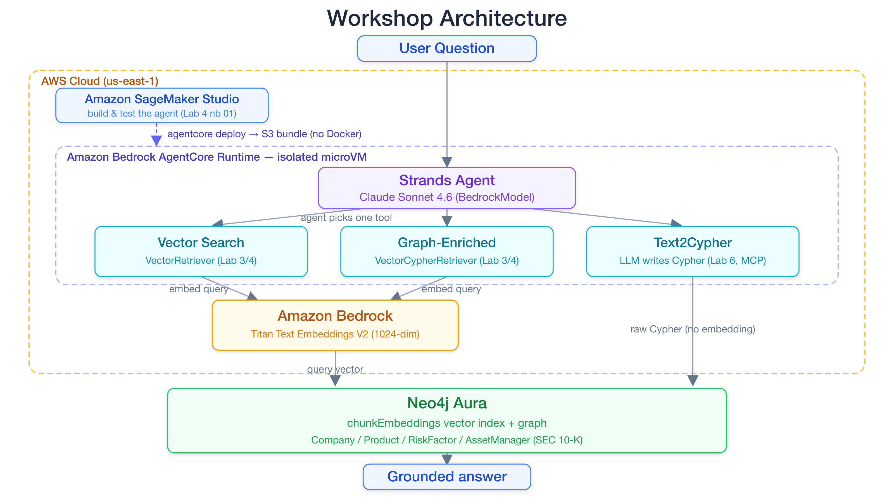

# Workshop Architecture and Roadmap

Building Knowledge Graph-Powered AI Agents

---

## What You Will Build

- A **knowledge graph** from SEC 10-K financial filings, loaded from a governed S3 lakehouse (Apache Iceberg) via AWS Glue and the Neo4j Spark Connector
- **GraphRAG retrieval pipelines** that combine vector search with graph traversal
- **AI agents** that query the knowledge graph

By the end, an agent can answer: "Which risk factors expose BlackRock's portfolio across multiple companies?" by traversing ownership chains and risk relationships in the graph.

---

## Why Neo4j + AWS?

Two platforms solve **different problems well**.

**AWS** provides managed foundation models (Bedrock), development environments (SageMaker), serverless agent hosting (AgentCore), and a governed data lakehouse that feeds enterprise data into the graph.

**Neo4j** provides a native graph database that stores entities and relationships as first-class structures, with built-in vector search and graph traversal.

Together: AWS aggregates and governs the data and provides the reasoning and generation layer, while Neo4j makes relationships traversable for retrieval.

---

---

---

## The SEC Financial Data Domain

Public companies file **10-K annual reports** with the Securities and Exchange Commission. These filings contain:

- Business operations and product descriptions
- Risk factor disclosures
- Financial results and executive information
- Institutional ownership data

The workshop builds a knowledge graph from this data, connecting companies, products, risk factors, and asset managers.

---

This workshop's graph is **pre-loaded**. You work with it directly from Lab 1. The optional Lab 2 rebuilds it from `financial_data.json` with Amazon Titan Text Embeddings V2 instead of running the full lakehouse job.

---

---

---

## Workshop Architecture

| Layer | Technology | Purpose |
|-------|-----------|---------|
| **Data Pipeline** | AWS Glue + S3 Iceberg lakehouse + Neo4j Spark Connector | Govern and load enterprise data into the graph |
| **Knowledge Graph** | Neo4j Aura | Store entities, relationships, vector embeddings |
| **Reasoning** | Anthropic Claude (via Bedrock) | Tool selection, response generation |
| **Embeddings** | Amazon Titan Text Embeddings V2 (via Bedrock) | Vector representations for semantic search |
| **Development** | SageMaker Studio | JupyterLab notebooks |
| **Agent Hosting** | AgentCore Runtime | Serverless agent deployment |
| **Tool Protocol** | MCP (Model Context Protocol) | Agent-to-graph connectivity |

---

## Workshop Roadmap

**Part 1: Setup & Exploration** (Labs 0-1)
- Lab 0: Sign in to AWS and enable Bedrock access
- Lab 1: Provision Neo4j Aura, load the seed graph, explore it with Cypher

**Part 2: GraphRAG Pipelines & Agents** (Labs 2-4)
- Lab 2: Data pipeline — chunking, embeddings, indexing (optional)
- Lab 3: Semantic search and GraphRAG with neo4j-graphrag
- Lab 4: GraphRAG agent and deployment to AgentCore

**Part 3: Agent Memory** (Lab 5)
- Lab 5: Add short and long-term memory to the agent with Neo4j

**Part 4: Neo4j MCP Server** (Lab 6, optional)
- Lab 6: Schema-first Text2Cypher agent over the Model Context Protocol

